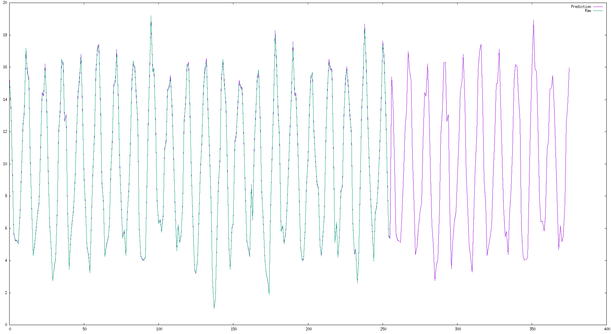

# TemperatureForecast-ACSE-5
Homework 1 for ACSE-5

## Things to do

1. CArray
4. FFT Optimise

## Usage

#### Download

To download the data files from [Met Office](https://www.metoffice.gov.uk/), make sure you have installed [Curl](https://curl.haxx.se/) (or from [GitHub](https://github.com/curl/curl)) on your device. Then, compile the *DataUtil.cpp* source file linked with *curl*.
```
g++ DataUtil.cpp -o Download.out -lcurl && ./Download.out
```

#### Prediction using FFT

To compile the main file, using
```
g++ Main.cpp -o Main.out
 ```

The program takes two arguments as input, the station name and the periods you wanna predict.

For example, if you want to predict the average temperatures of next 12 months of Heathrow Station, the command should be
```
./Main.out Heathrow 12
```

## Result

### Method 1 - Fast Fourier Transformation - BETTER

* Heathrow Station - Next 5 Years - RMSE: 0.0544736


* Shawbury Station - Next 10 Years - RMSE: 0.118409



### Method 2 - Exponential Smoothing - BAD

* Basic Exponential Smoothing   RMSE: 3.15936

* Double Exponential Smoothing   RMSE: 3.08166

* Triple Exponential Smoothing   RMSE: 3.18623

### Data Source

* [Met Office](https://www.metoffice.gov.uk/) Climate and climate change - Historic station data
